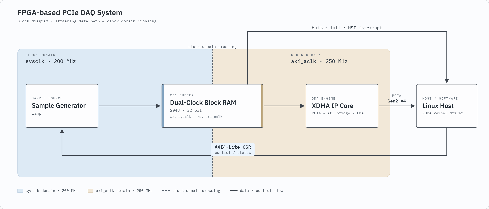
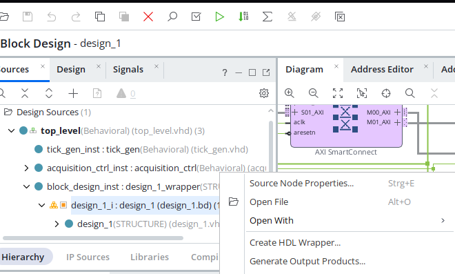
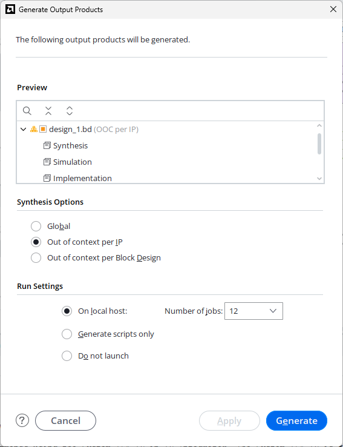
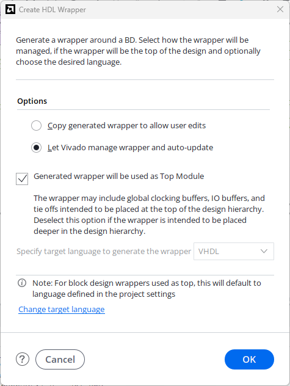
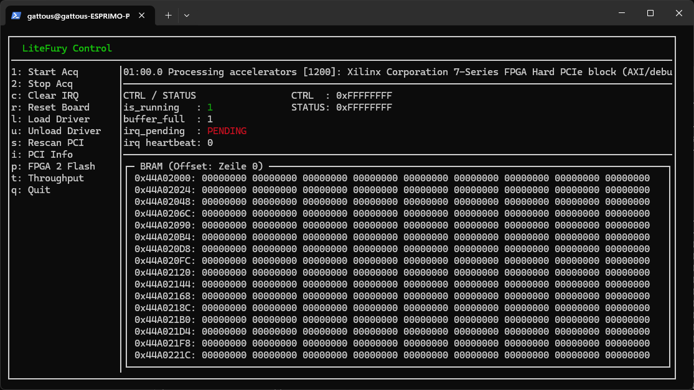
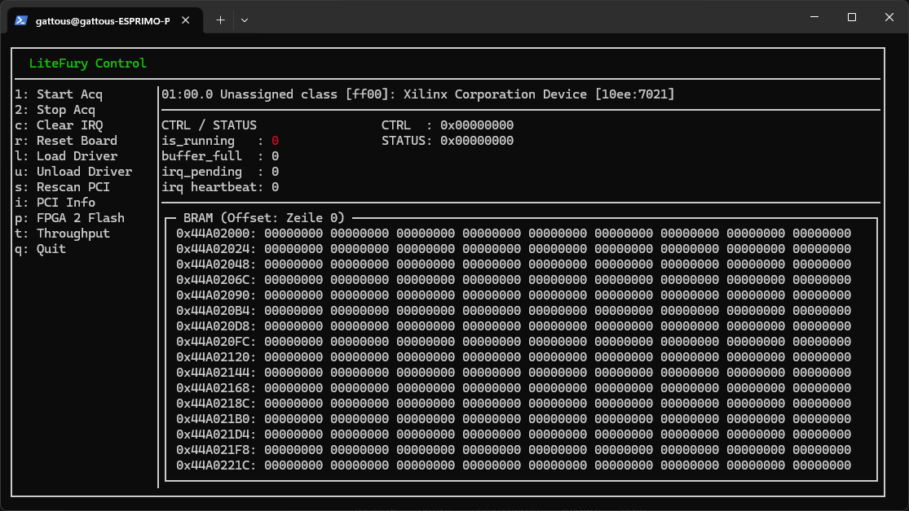

# LiteFury PCIe DAQ

A small but complete PCIe data acquisition design for the **LiteFury** board
(Xilinx Artix-7 `xc7a100tfgg484-2`, M.2 2280 Key-M), written in **VHDL**.

The FPGA generates a sample stream, buffers it in on-chip Block RAM, and a Linux
host reads that buffer out over PCIe using the Xilinx XDMA driver. Control and
status go through a custom AXI4-Lite register block, and a buffer-full condition
raises an MSI interrupt on the host.

Nothing here is clever. That is the point: it is meant to be readable.

---

## Why this exists

When I started with PCIe on the LiteFury, I could find the board files, the XDMA
product guide, and a handful of large complete projects. What I could not find
was anything in between: a small, end-to-end example that shows the whole chain
in one place and says out loud where the sharp edges are.

So this is the thing I wish I had found. It is deliberately minimal: one signal
source, one buffer, one interrupt, one host program. If you are trying to get
your first PCIe design onto a LiteFury (or any Artix-7 XDMA setup), this should
get you from "the board enumerates" to "I can see my own data on the host".

---

## What it does (current state)



* **Sample generator.** A counter-based ramp with a fixed sample rate. Because
  each sample is also its own sequence number, any dropped sample shows up later
  as a discontinuity. It runs on the onboard 200 MHz oscillator, independent of
  the PCIe clock, like a real DAQ card with its own sampling clock.
* **Buffer.** Dual-clock Block RAM, 2048 samples of 32 bit (8 KB). Port B is
  written by the generator in the `sysclk` domain, port A is read by the host
  through an AXI BRAM Controller in the `axi_aclk` domain. The dual-clock BRAM
  *is* the clock-domain crossing for the data path. Single control and status
  bits cross through 2-flip-flop synchronizers.
* **CSR.** A custom AXI4-Lite slave (`axi_csr`) with control and status
  registers, reachable from the host through a BAR. The interrupt-pending bit
  uses write-1-to-clear semantics.
* **Interrupt.** When the buffer fills, the design asserts `usr_irq_req` on the
  XDMA core and the host receives an MSI. A small state machine then waits for
  the host to acknowledge and clear the pending bit before restarting
  acquisition.

The default sample rate is 30 samples/s, so filling the 2048-sample buffer takes
a bit over a minute. That is intentionally slow: it makes the fill visible and
easy to poke at by hand before you automate anything.

### Reading the LEDs

The four onboard LEDs are a heartbeat, and they tell you which state the card is
in without attaching a debugger:

* **All four blinking together, once per second.** Idle. Acquisition is not
  enabled, the card is waiting for the host to set the enable bit.
* **Counting up in binary, once per second.** Acquisition is running. The
  pattern is a 4-bit counter, so it visibly walks through 0, 1, 2, 3 and so on.

If the LEDs are frozen in either mode, something upstream is stuck (clock, reset,
or the state machine).

## What it does not do yet

Being explicit, so you know what you are getting:

* Single buffer only. Acquisition stops while the host reads, so continuous
  streaming without sample loss is not supported. See
  [What comes next](#what-comes-next).
* The ramp is checked visually, not by an automated gap-check in software.
* The buffer lives in BRAM, not DDR3, so capacity is small.
* No external analog input. The signal source is synthetic.

---

## Requirements

**Hardware**

* LiteFury board in an M.2 Key-M slot with PCIe lanes wired up (not SATA-only)
* JTAG programmer for loading the bitstream

**FPGA toolchain**

* Vivado 2025.2. Older versions will likely work but are untested.

**Host**

* Linux, developed on Xubuntu. Root access is needed for driver loading.
* The Xilinx XDMA kernel driver from
  [Xilinx/dma_ip_drivers](https://github.com/Xilinx/dma_ip_drivers). Build and
  install it separately, it is not vendored here.

---

## Repository layout

```
fpga/                        Vivado project, VHDL sources, constraints
  Scripts/                   helper scripts and notes
host_app/
  litefury-xdma-monitor/     terminal UI that dumps the BRAM buffer
  manual_scripts/            small shell scripts for driver, PCI and CSR access
```

---

## Building the FPGA design

> **Read this first.** After a fresh `git clone` the project will not synthesize
> straight away, and the error message does not point at the real cause.
> Generated files are deliberately not committed, so you have to regenerate them
> once.

1. Open `fpga/litefury_pcie_daq.xpr` in Vivado.
2. In the **Sources** panel, right-click `design_1.bd` and choose
   **Generate Output Products...**. Leave the defaults (*Out of context per IP*)
   and click **Generate**. This takes a few minutes.
3. Still on `design_1.bd`, right-click and choose **Create HDL Wrapper...** if
   the wrapper is missing.
4. Run **Generate Bitstream**.

If you skip step 2, synthesis fails with this:

```
[DRC INBB-3] Black Box Instances: Cell 'block_design_inst' of type
'design_1_wrapper' has undefined contents and is considered a black box.
```

That means the block design's output products were never generated in your local
copy. Go back to step 2.



<p align="center">
  
  
</p>

### Just want the bitstream?

A prebuilt `top_level.bit` is attached to the
[latest release](../../releases).

This is a **JTAG configuration bitstream only**. It loads into the FPGA's
configuration SRAM and is gone after the next power cycle. It does not touch the
onboard flash and does not permanently change your board.

---

## Running it

### 1. Load the XDMA driver:

```bash
cd host_app/manual_scripts
./load_xdma_driver.sh
```

### 2. Verify device creation and PCIe link status:

a) Check that the XDMA character devices were created:

```bash
ls -l /dev/xdma0_*
```
```
crw------- 1 root root 235, 100 Aug  3 16:48 /dev/xdma0_bypass
crw------- 1 root root 235,  68 Aug  3 16:48 /dev/xdma0_bypass_c2h_0
crw------- 1 root root 235,  64 Aug  3 16:48 /dev/xdma0_bypass_h2c_0
crw------- 1 root root 235,  36 Aug  3 16:48 /dev/xdma0_c2h_0
crw------- 1 root root 235,   1 Aug  3 16:48 /dev/xdma0_control
...
crw------- 1 root root 235,  32 Aug  3 16:48 /dev/xdma0_h2c_0
crw------- 1 root root 235,   0 Aug  3 16:48 /dev/xdma0_user
crw------- 1 root root 235,   2 Aug  3 16:48 /dev/xdma0_xvc
```

b) Verify PCIe link configuration:

```bash
sudo lspci -vvn -d 10ee:
```
```
01:00.0 ff00: 10ee:7021
        Subsystem: 10ee:0007
        ...
        Region 0: Memory at fe510000 (32-bit, non-prefetchable) [size=4K]
        Region 1: Memory at fe500000 (32-bit, non-prefetchable) [size=64K]
        Region 2: Memory at fe400000 (32-bit, non-prefetchable) [size=1M]
        ...
        Capabilities: [60] Express (v2) Endpoint, IntMsgNum 0
                DevCap: MaxPayload 512 bytes, PhantFunc 0, Latency L0s <64ns, L1 unlimited
                        ...
                DevCtl: MaxPayload 128 bytes, MaxReadReq 512 bytes
                        ...
                LnkCap: Port #0, Speed 5GT/s, Width x4, ASPM L0s, Exit Latency L0s unlimited
                        ...
                LnkSta: Speed 5GT/s, Width x4
                        ...
        Kernel driver in use: xdma
```

> 💡 **Note:** Look for `LnkSta: Speed 5GT/s, Width x4` in the output above. If
> you see fewer lanes or a lower speed, your PCIe slot or host adapter is the
> bottleneck, not this design.

### 3. Start acquisition, wait for the interrupt, then look at the buffer:

```bash
./start_acquisition.sh
./wait_for_irq.sh
./watch_bram_end.sh
```

### 4. Or use the terminal monitor for a live view of the buffer contents:

Build the project:

```bash
cd host_app/litefury-xdma-monitor
make
```

Run the TUI with root privileges (required for file descriptor access and
loading/unloading `xdma.ko`):

```bash
sudo ./litefury-tui
```

If you already loaded the driver in step 1, the TUI will detect it
automatically. Alternatively, skip step 1 entirely and press `l` inside the
TUI to load the driver from there (the compiled `xdma.ko` must be in the same
folder as `litefury-tui`).



Once the driver is loaded, the buffer dump becomes visible:



---

## Register map

Base address: BAR-mapped, see the `pciinfo.sh` output.

> ℹ️ **Interface Note:** **BAR2** operates as an **AXI Bypass** register
> interface. Block RAM (BRAM) memory space starts at offset **`0x2000`**
> within BAR2.

---

### 1. Register Overview (BAR2 - AXI Bypass)

| Byte Offset | Register Name | Access | Description |
| :--- | :--- | :---: | :--- |
| `0x00` | **`CONTROL`** | `RW` | Acquisition control *(see bitfield breakdown below)* |
| `0x04` | **`STATUS`** | `RO / W1C` | Hardware status flags *(see bitfield breakdown below)* |
| `0x2000` | **`BRAM_BASE`** | `RW` | Start address of Block RAM (BRAM) memory space |

---

### 2. Register Detail: `CONTROL` (`0x00`)

| Bit(s) | Field Name | Access | Default | Description |
| :---: | :--- | :---: | :---: | :--- |
| **`0`** | `ENABLE_ACQUISITION` | `RW` | `0b0` | **`1`**: Start acquisition<br>**`0`**: Stop / idle |
| **`31:1`** | *Reserved* | — | `0x0` | *Reserved for future use* |

<!-- TODO: confirm bit 0 is correct for enable_acquisition, adjust if the real
     layout differs -->

### 3. Register Detail: `STATUS` (`0x04`)

| Bit(s) | Field Name | Access | Default | Description |
| :---: | :--- | :---: | :---: | :--- |
| **`0`** | `RUNNING` | `RO` | `0b0` | **`1`**: Acquisition active / running<br>**`0`**: System idle |
| **`1`** | `BUFFER_FULL` | `RO` | `0b0` | **`1`**: Memory buffer capacity reached |
| **`2`** | `IRQ_PENDING` | `W1C` | `0b0` | **`1`**: Interrupt requested *(Write `1` to clear flag)* |
| **`31:3`** | *Reserved* | — | `0x0` | *Reserved for future use, always reads as `0`* |

---

## Performance

Measured: **~244 MB/s**, reading 8 KB per transfer.

A PCIe Gen2 x4 link carries roughly 2 GB/s raw per direction, and with the
128-byte maximum payload size negotiated on my machine the realistic ceiling is
around 1.7 GB/s. So 244 MB/s looks bad. The link is not the problem though, and
the first step is proving that rather than guessing.

### Step 1: check what the link actually negotiated

```bash
sudo lspci -vv -d 10ee:
```
```
01:00.0 ff00: 10ee:7021
        ...
        Capabilities: [60] Express (v2) Endpoint, IntMsgNum 0
                DevCap: MaxPayload 512 bytes, PhantFunc 0, Latency L0s <64ns, L1 unlimited
                        ...
                DevCtl: MaxPayload 128 bytes, MaxReadReq 512 bytes
                        ...
                LnkCap: Port #0, Speed 5GT/s, Width x4, ASPM L0s, Exit Latency L0s unlimited
                        ...
                LnkSta: Speed 5GT/s, Width x4
                        ...
```

Two things to read out of this:

* `LnkSta` matches `LnkCap`, so all four lanes trained at Gen2 speed. There is no
  hidden x1 fallback, and there is no such thing as "the DMA only uses one lane":
  PCIe stripes bytes across all active lanes in the physical layer.
* `DevCap` says the card could do 512-byte payloads, but `DevCtl` shows 128 bytes
  in actual use. That is decided by the BIOS and root complex for the entire
  path, not by the FPGA design, and there is no Vivado setting for it. My host is
  an older machine that pins everything to 128 bytes.

### Step 2: where the time actually goes

With the link ruled out, the arithmetic is short:

* One 8 KB transfer takes about 33 us in practice.
* At link speed, moving 8 KB should take about 4.8 us.

That leaves roughly 28 us of fixed cost on every single transfer: descriptor
setup, syscall overhead, and the round-trip latency before the first data comes
back. With 8 KB chunks the link is idle around 85% of the time. The fix is not a
faster link, it is either bigger transfers or overlapping acquisition with
readout so the waiting is hidden behind useful work.

---

## What comes next

The single-buffer design here stops acquiring while the host reads, which is fine
for a demo and useless for real measurement. Continuous acquisition is the
follow-up project, **LiteFury PCIe DAQ 2**: a ping-pong buffer, two BRAMs
swapped between generator and host, so the generator keeps filling one buffer
while the host drains the other, plus an overflow counter for when the host
cannot keep up.

(https://github.com/sanfour2011/litefury_pcie_daq_2)
---

## Credits

* The constraints (`.xdc`) are based on
  [hdlguy/litefury_pcie](https://github.com/hdlguy/litefury_pcie), which saved
  me a lot of pin-hunting.
* Xilinx PG195, the XDMA product guide, is the reference for everything
  XDMA-related.

## License

MIT, see [LICENSE](LICENSE). Files inherited from another repo (e.g. the
`.xdc` constraints) keep their original license.
