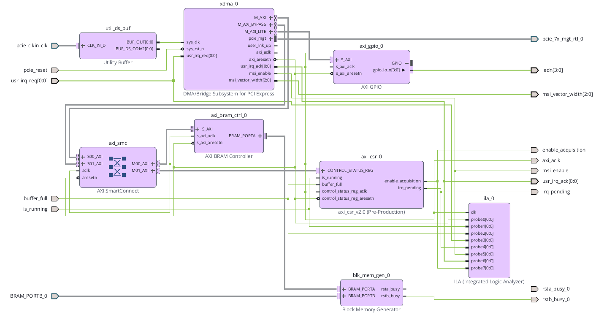

# FPGA sources: what each file does

A short map of the design, entity by entity, for anyone reading the code who
was not there when it was written.

The design has two parts:

* **VHDL entities** (`top_level.vhd` and below) - the autonomous side, on
  `sysclk`, that generates and buffers samples.
* **Vivado Block Design** (`design_1.bd`) - the PCIe/host-facing side, built
  from Xilinx IP plus one custom IP of my own (`axi_csr`).

---

## VHDL entities

### `top_level.vhd`

The top of the design. Instantiates everything below, wires the physical pins
(from the `.xdc` files) to the block design and the hand-written logic, and
owns two small pieces of glue logic that did not deserve their own entity:

* **CDC (clock domain crossing) synchronizers** for every single-bit
  control/status signal that crosses between `sysclk` and `axi_aclk`
  (`enable_acquisition`, `irq_pending`, `usr_irq_ack`). Each is a 2-flip-flop
  chain with the `ASYNC_REG` attribute set, so the tools do not optimize the
  two flip-flops into one.
* **`irq_handler` process** - a 3-state FSM (`IDLE`, `WAIT_FOR_HOST_ACK`,
  `WAIT_FOR_IRQ_PENDING_CLEARED`) that drives `usr_irq_req` when the buffer
  fills, waits for the XDMA core to confirm the MSI was sent
  (`usr_irq_ack`), then waits for the host to clear `irq_pending` (W1C) before
  releasing the acquisition reset and starting over.

### `tick_gen.vhd`

A generic clock divider. Given `CLK_FREQ_HZ` and `TICK_RATE_HZ`, it produces a
single-cycle `tick` pulse at the requested rate. Used twice in spirit: once at
1 Hz for the LED heartbeat, and the same pattern underlies the sample-rate
timing inside `acquisition_ctrl`.

### `acquisition_ctrl.vhd`

Owns the acquisition state: starts/stops on `acq_en`, reports `is_running` and
`buffer_full`, and produces one sample per tick (`sample_ready`, `sample_out`,
`sample_idx`). Internally generates the sawtooth/ramp sample as its own
sequence counter, so a lost sample is directly visible later as a jump in the
data rather than a silent gap. Runs entirely on `sysclk`, independent of the
PCIe clock, the way a real DAQ card free-runs on its own sampling clock.

---

## Vivado Block Design (`design_1.bd`)

Everything below is Xilinx IP wired together in the Block Design GUI, with one
exception.

| IP instance | Role |
|---|---|
| `xdma_0` | Xilinx XDMA core. PCIe Gen2 x4 endpoint, handles the link, generates the MSI interrupt, and exposes the AXI4-Lite master (`M_AXI_LITE`) used for the BAR-mapped register/BRAM access in this design. |
| **`axi_csr_0`** | **My own IP.** A custom AXI4-Lite slave holding the control/status registers (`CONTROL`, `STATUS`), including the write-1-to-clear `IRQ_PENDING` bit. Packaged as reusable IP so it can be instantiated and upgraded like any Xilinx block. See the register map table in the top-level project README for the exact bit layout. |
| `axi_bram_ctrl_0` | Bridges the host-facing AXI4 (byte-addressed) side of the buffer to Port A of the Block RAM. |
| `blk_mem_gen_0` | The dual-clock Block RAM itself. Port A (byte-addressed) faces the host through the BRAM controller; Port B (word-addressed) is driven directly from `top_level.vhd` by the sample generator. This dual-clock BRAM is the data-path clock domain crossing. |
| `axi_smc` | AXI SmartConnect. Routes the XDMA master(s) to the right slave (`axi_csr`, `axi_bram_ctrl`, `axi_gpio`) based on address. |
| `axi_gpio_0` | Drives the 4 onboard LEDs, active-low, from the host side (used in earlier phases; superseded on the LED side by the `sysclk`-driven heartbeat in `top_level.vhd`, kept in the design as a working AXI-GPIO reference point). |
| `util_ds_buf` | Differential clock buffer for the PCIe reference clock input. |
| `ila_0` | Integrated Logic Analyzer, used for in-hardware debug during bring-up. Not required for the design to function; safe to remove if you do not need hardware debug visibility. |

---

## Why the split

The boundary between hand-written VHDL and the Block Design is deliberate: the
autonomous sample generation and buffering logic (the part that mimics a real
sensor front end) is fully hand-written and independent of PCIe entirely, while
everything that only exists to talk to the host over PCIe is standard Xilinx
IP, wired together rather than reinvented. `axi_csr` is the one place those two
worlds meet as a custom register interface.
